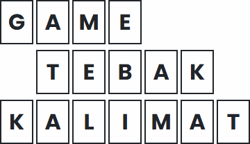

# Game Tebak Kalimat (Laravel Based)

    

This is a Laravel based Words Puzzle Game (Game Tebak Kalimat), in Indonesian language. Well, to be honest it's kinda mixed, but mostly it's in Indonesian and hardcoded. Oh, and it's session based, so no need to use any DB, migration, or all that. The sentence/words pack is stored as .json too.

The initial inspiration for this was [Magic the Noah](https://www.youtube.com/@MagicTheNoah)'s [Video](https://www.youtube.com/watch?v=5jKrwKQWXQ0). BUT, this version doesn't have all the bullshit rule and it's pretty much normal. I did plan to add Shop and Item system, where players could earn golds to buy items that may double their points, go twice in a row, skip someone's turn, etc., but yeaaaa, those are too hard to implement (at least by someone with my knowledge). So yeah.

## How The Game Workds
This game works pretty much similar to how Magic the Noah's version, there will be one game master (basically the one who controls it), and others could join (either in real life or maybe through Discord call). Game Master then asks the current turn player whether they wanna guess a letter or guess the whole sentence. Once a guess is done, it's automatically moved to the next player's turn (or round if the sentence is correctly guessed).

## The Game Rules
The players can either guess a letter or the whole sentence.
- If guessing a letter
  - If guessed correctly, the reward is 25 + (100 / amount of guessed letter revealed). So, for example, if a player guessed letter 'A' and there were 5 'A' revealed, then the score would be 25 + (100 / 5) = 45.
  - If guessed incorrectly, immediate -25
  - I honestly don't knnow if it's balanced or not. I tried to make it so that common letters are worth less than rare letters. But this depends on the sentence itself. I probably should've made sentence-based scoring. Probably will implement in the future.
- If guessing the whole sentence
  - If guessed correctly, the reward is 100 + (20 * remaining unrevealed letters). So if the sentence was "GAME TEBAK KALIMAT" and at the time, it's "\_A\_E \_EBAK KA\_\_MA\_", and a player guessed the whole sentence correctly, they would get 100 + (20 * 6) = 220
  - If guessed incorrectly, the punishment is -20 * remaining unrevealed letters. By using the sentence above, then it would take away 120 of current's player score.

## How to Install and Play
Welp, just like any other Laravel web app.
1. Clone this project to your local machine
2. Make sure you have minimum PHP 8.3 and Composer
3. Run `Composer Install`
4. Then run `php artisan key:generate`
5. Don't forget to make the .env files from the .env.example. Make sure to change SESSION_DRIVER to `file`, SESSION_LIFETIME to `300`, and CACHE_STORE to `file`
6. After that, you can run `php artisan serve` and then access `localhost:8000` on your browser to play

## Another Credits Section
Here are the credits section for what other components I used to make this game :
1. [Laravel 13](https://github.com/laravel/laravel)
2. [Bootstrap 5.3](https://getbootstrap.com/docs/5.3/)
3. [Jquery](https://jquery.com/)
4. [SweetAlert2](https://sweetalert2.github.io/)
5. [OpenMoji](https://openmoji.org/)
